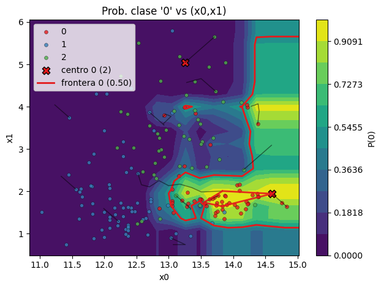

# SheShe
<div align="right"><a href="README_ES.md">ES</a></div>
 
**📚 Full documentation:** https://jcval94.github.io/SheShe/

**Smart High-dimensional Edge Segmentation & Hyperboundary Explorer**

SheShe turns probabilistic models into guided explorers of their decision surfaces, revealing human‑readable regions by following local maxima of class probability or predicted value.



## Features
- Supervised clustering for classification and regression
- Rule extraction and subspace exploration
- InsideForest for interpretable random-forest rule clustering (reuse pretrained forests and inspect per-stage timings)
- 2D/3D plotting utilities

## Mathematical Overview
SheShe approximates the optimisation problem <code>max_x f(x)</code> by climbing gradient-ascent paths toward local maxima and delineating neighbourhoods around them. Detailed derivations for each module are provided in the documentation.

## Installation
Requires Python ≥3.9.

### Dependencies

**Main**

- [NumPy](https://numpy.org/) for numerical operations
- [Pandas](https://pandas.pydata.org/) for tabular data
- [scikit-learn](https://scikit-learn.org/) for model training
- [Matplotlib](https://matplotlib.org/) for visualisation
- [hnswlib](https://github.com/nmslib/hnswlib) for fast nearest-neighbour search

**Optional**

- [LightGBM](https://lightgbm.readthedocs.io/) for gradient boosting models
- [SHAP](https://shap.readthedocs.io/) and [Interpret](https://interpret.ml/) for model explanations

### From PyPI

Install from [PyPI](https://pypi.org/project/sheshe/):

```bash
pip install sheshe
```

### From source

```bash
git clone https://github.com/jcval94/SheShe.git
cd SheShe
pip install -e .
```

### Common issues

- **Windows**: Compiling packages such as `hnswlib` or `lightgbm` may require the
  [Build Tools for Visual Studio](https://visualstudio.microsoft.com/visual-cpp-build-tools/).
  Alternatively, use a [conda](https://conda.io/) environment or
  install via [WSL](https://learn.microsoft.com/windows/wsl/install).
- **macOS**: Ensure Xcode command-line tools are installed (`xcode-select --install`).
  Some dependencies (e.g. `lightgbm`) also need OpenMP support: `brew install libomp`.
  If wheels are unavailable, build from source using Homebrew-provided compilers.

## Documentation
See the [documentation](https://jcval94.github.io/SheShe/) for installation, API reference and guides.

## Rule search helpers (`sheshe.combiantions`)

Use `find_comb_dim_spaces` to discover low-dimensional rules from a set of planes, and
`plot_rule_metrics` to quickly inspect their quality:

```python
import matplotlib.pyplot as plt
import numpy as np
from sheshe import find_comb_dim_spaces, plot_rule_metrics

# Ejemplo minimalista: supongamos que ya tienes `sel` con `winning_planes`
X = np.random.randn(200, 4)
y = (X[:, 0] + 0.3 * X[:, 1] > 0).astype(int)

valuable = find_comb_dim_spaces(
    sel,  # tu selección de planos
    X,
    y,
    max_planes=3,
    metric="precision",
)

# Visualiza precisión vs recall, coloreando por número de dimensiones
ax = plot_rule_metrics(valuable, target_class=1, metric_x="recall", metric_y="precision")
plt.show()
```

## Contributing
Set up a virtual environment and install the development dependencies:

```bash
pip install -r requirements-dev.txt
pip install -e .
```

Run the tests to ensure everything works:

```bash
pytest
```

No linter is currently configured; feel free to run `black .` locally before submitting changes.

## Author
SheShe is authored by José Carlos Del Valle – [LinkedIn](https://www.linkedin.com/in/jose-carlos-del-valle/) | [Portfolio](https://jcval94.github.io/Portfolio/)

## License
MIT
